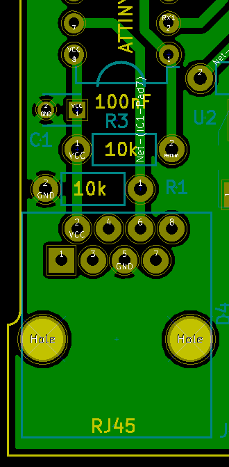
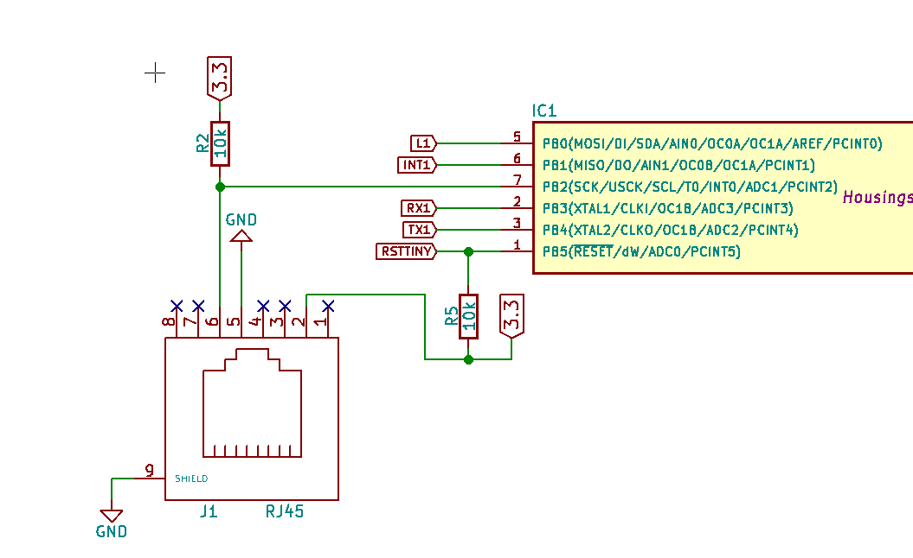
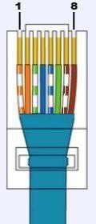

# EndeF-ecoBeat
EcoBeat is a device that measures the energy consumption by means of pulses. These pulses are generated by measuring equipment such as electricity, water or gas meters. EcoBeat translates the pulses to the corresponding units and transmits them via WIFI to a server on the Internet. This device complies with the Internet of Things standards and is specially designed to make energy measurements

# cable connection

## Optical pulse
- The pulse happens when the Interruption(6) is conected to  VCC(2)
- Interruption(6) -> pulldown

## Mechanical pulse
- The pulse happens when the Interruption(6) is conected to GND(5) 
- Interruption(6) -> pullup

## PCB Modification 
- 10K is disconected from GND and conected to Vcc

